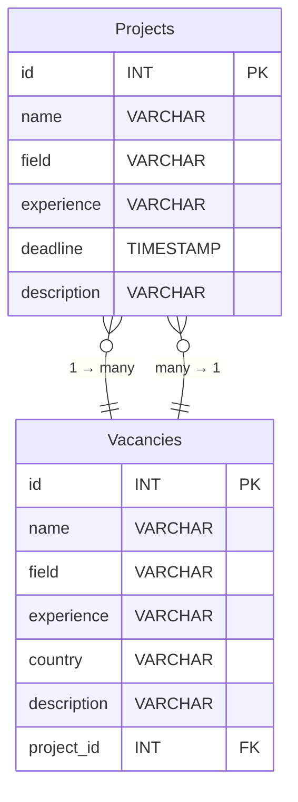

#### This is the Entity Relationship diagram for the application's database schema:

```mermaid
erDiagram
%%{init: {
  "theme": "default",
  "themeCSS": [
    ".er.relationshipLabel { fill: black; }",
    ".er.relationshipLabelBox { fill: white; }",
    ".er.entityBox { fill: lightgray}",
    "[id^=entity-Projects] .er.entityBox { fill: orange;} ",
    "[id^=entity-Vacancies] .er.entityBox { fill: powderblue;} "
    ]
}}%%

    Projects {
        id INT PK
        name VARCHAR
        field VARCHAR
        experience VARCHAR
        deadline TIMESTAMP
        description VARCHAR
    }
    Vacancies {
        id INT PK
        name VARCHAR
        field VARCHAR
        experience VARCHAR
        country VARCHAR
        description VARCHAR
        project_id INT FK
    }

    Projects }o--|| Vacancies : "1 → many"
    Vacancies ||--o{ Projects : "many → 1"
%%    Users ||--o{ Favorites : "1 → many"
%%    Users ||--o{ Orders : "1 → many"
%%    Orders ||--o{ OrderItems : "1 → many"
%%    Products ||--o{ OrderItems : "1 → many"

```